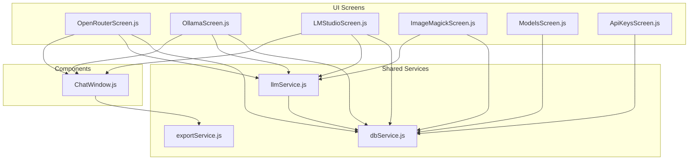

# Walkthrough: Shared LLM API Logic Refactoring

We refactored the Tauri v2 application so that all LLM API calls, database lookups, markdown export, and chat UI patterns are centralized into shared service modules and a reusable component.

## Architecture Overview

---

## Changes Summary

### 1. New Shared Modules

- **[`dbService.js`](file:///c:/Users/HP/Documents/DEV/SandBox/Tauri/tauri-api-tool/src/services/dbService.js)**: Centralized SQLite connection management, table DDL creation (`ensureTables`), API key lookup (`getApiKey`, `getApiKeyForModel`), model queries by provider (`getModelsForProvider`, `getModelsForProviders`), and distinct provider discovery (`getDistinctProviders`).
- **[`llmService.js`](file:///c:/Users/HP/Documents/DEV/SandBox/Tauri/tauri-api-tool/src/services/llmService.js)**: Unified HTTP fetch (`httpFetch`) supporting Tauri HTTP and standard browser `fetch`, endpoint resolution (`getProviderEndpoint`), headers builder (`getProviderHeaders`), unified response parser (`parseAssistantResponse`), and high-level `chatCompletion()` supporting OpenRouter, Ollama, and LM Studio.
- **[`exportService.js`](file:///c:/Users/HP/Documents/DEV/SandBox/Tauri/tauri-api-tool/src/services/exportService.js)**: Shared markdown export functionality via Tauri dialog and fs APIs (`exportToMarkdown`).
- **[`ChatWindow.js`](file:///c:/Users/HP/Documents/DEV/SandBox/Tauri/tauri-api-tool/src/components/ChatWindow.js)**: Reusable Preact chat UI component managing message bubbles, auto-scroll, thinking spinners, input textarea with Enter/Shift+Enter handling, Clear chat, and markdown export links.

---

### 2. Refactored Screens

| Screen | Changes | Lines Before → After |
|---|---|---|
| **[`OpenRouterScreen.js`](file:///c:/Users/HP/Documents/DEV/SandBox/Tauri/tauri-api-tool/src/screens/OpenRouterScreen.js)** | Uses `chatCompletion`, `getModelsForProvider`, and `<ChatWindow>`. Retained reasoning toggle, system prompt, error rollback behavior. | 274 → 137 lines |
| **[`OllamaScreen.js`](file:///c:/Users/HP/Documents/DEV/SandBox/Tauri/tauri-api-tool/src/screens/OllamaScreen.js)** | Uses `chatCompletion`, `getModelsForProvider`, and `<ChatWindow>`. Retained base URL selector, system prompt, and non-rollback error handling. | 228 → 126 lines |
| **[`LMStudioScreen.js`](file:///c:/Users/HP/Documents/DEV/SandBox/Tauri/tauri-api-tool/src/screens/LMStudioScreen.js)** | Uses `chatCompletion`, `httpFetch`, `getModelsForProviders`, and `<ChatWindow>`. Preserved all CLI/HTTP server status checking, server launching, config persistence, and temperature slider. | 492 → 355 lines |
| **[`ImageMagickScreen.js`](file:///c:/Users/HP/Documents/DEV/SandBox/Tauri/tauri-api-tool/src/screens/ImageMagickScreen.js)** | Uses `chatCompletion`, `ensureTables`, `getModelsForProvider`, and `getDistinctProviders`. Retained all image previewing, prompt formulation, command extraction, token parsing, and execution. | 600 → 509 lines |
| **[`ModelsScreen.js`](file:///c:/Users/HP/Documents/DEV/SandBox/Tauri/tauri-api-tool/src/screens/ModelsScreen.js)** | Uses `ensureTables` from `dbService.js` instead of inline DDL. Preserved all CRUD operations. | 186 → 181 lines |
| **[`ApiKeysScreen.js`](file:///c:/Users/HP/Documents/DEV/SandBox/Tauri/tauri-api-tool/src/screens/ApiKeysScreen.js)** | Uses `ensureTables` from `dbService.js` instead of inline DDL. Preserved all CRUD operations and key masking. | 215 → 209 lines |

---

## Verification Results

- All new and modified JavaScript files were validated for syntax using `node -c`:
  - `src/services/dbService.js` ✅
  - `src/services/llmService.js` ✅
  - `src/services/exportService.js` ✅
  - `src/components/ChatWindow.js` ✅
  - `src/screens/OpenRouterScreen.js` ✅
  - `src/screens/OllamaScreen.js` ✅
  - `src/screens/LMStudioScreen.js` ✅
  - `src/screens/ImageMagickScreen.js` ✅
  - `src/screens/ModelsScreen.js` ✅
  - `src/screens/ApiKeysScreen.js` ✅
  - `src/App.js` & `src/main.js` ✅
